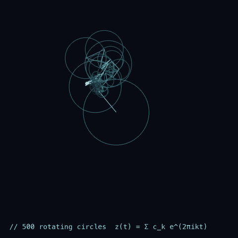

<a href="https://oscar-chw.github.io"><b>Hover the interactive version</b></a> &nbsp;·&nbsp; <code>roofline</code> BTC/USDT monthly close &nbsp;·&nbsp; <code>windows</code> green up days, red down days &nbsp;·&nbsp; <code>beams</code> the <a href="https://github.com/oscar-chw/qts-platform-showcase">QTS data platform</a>: 12 readers, 5 writers, 0 lost &nbsp;·&nbsp; <code>t = now</code> nothing to its right is used (<a href="https://github.com/oscar-chw/agentic-quant-research/tree/main/platform">the research platform</a>) &nbsp;·&nbsp; <code>water</code> a BTC/USDT order book refreshed daily, green bids and red asks (<a href="https://github.com/oscar-chw/agentic-quant-research/tree/main/platform/packages/imc-sim">Market-Making Lab</a>)

# Oscar Choi

Computer Science at CUHK, with minors in Data Analytics and Informatics, and Business (graduating July 2027). I build quant research infrastructure and test trading ideas against point-in-time data, with explicit controls and costs. I am the sole developer and architect of the CUHK Quant Trading Society research team's data platform and a WorldQuant BRAIN research consultant.

<b>How this page is drawn</b>

- **The harbour** is built from data: one building per month of BTC/USDT (Binance daily closes, 2020 to now). The roof is the monthly close on a log scale, the white light is the monthly high, and each window is one trading day: green up, red down. Past "now" the towers are unlit blueprints, because nothing from the future is used. Packets on the beams replay the data platform's race test: 12 readers and 5 writers (4 appending, 1 rewriting a partition), with no commit lost. The water holds a Binance BTC/USDT order book, redrawn daily by a scheduled workflow: green bids, red asks. It all moves in plain SVG and CSS, since GitHub runs no scripts.
- **The portrait** is one continuous line through the edges of my photo, rewritten as a Fourier series, z(t) = Σ ck e2πikt: 500 circles, each turning at its own frequency, and the pen at the end of the chain redraws the face.

## Results

- **IMC Prosperity 4** (team SHDC): 904th of 18,803 teams, 18th in Hong Kong.
- **Kaggle Pokémon TCG AI Battle**: team entry, 2,043rd of 6,807 teams on the Simulation leaderboard (read 2026-09-13).
- **MonsoonSIM Enterprise Resource Management Competition 2025**: 3rd place (second runner-up).

## Projects

### 1. AI quant research system

One system: a vault of cited notes and results, a harness whose gates decide when work is done, and AI coding agents that read, build and review. Front page: [agentic-quant-research](https://github.com/oscar-chw/agentic-quant-research).

| Component | Role in the system | One number |
|---|---|---|
| [agentic-quant-research](https://github.com/oscar-chw/agentic-quant-research) | Centrepiece build: a Claude Code orchestrator and its subagents turned a quant-finance textbook into 1,805 paraphrased, cited claims and a tested Python library (whole project: about 140 subagents, 266 gated tasks) | 1,417 of 1,615 implemented claims verified by passing tests (773 tests, 0 failing) |
| [platform/](https://github.com/oscar-chw/agentic-quant-research/tree/main/platform) | Point-in-time research harness: an LLM proposes hypotheses but never scores them; pre-registered gate, human promotion. Includes the [Factor Lab](https://github.com/oscar-chw/agentic-quant-research/tree/main/platform/packages/factor), the [Market-Making Lab](https://github.com/oscar-chw/agentic-quant-research/tree/main/platform/packages/imc-sim) and a C++20 order-book replay port | 120 hypotheses screened on real Binance data; the gate blocked both control picks. C++20 replay ~2.3× faster end-to-end from Python (synthetic benchmark) |
| [agent-harness](https://github.com/oscar-chw/agent-harness) | The harness, packaged: shared rules and memory tools for seven AI coding tools, and a command guard for Claude Code | Guard blocks 39 of 45 held-out dangerous commands, 20/20 safe pass |
| [quant-research-vault](https://github.com/oscar-chw/quant-research-vault) | Paper layer of the vault: arXiv/OpenAlex ingestion into SQLite and ChromaDB, served through a read-only MCP search server | 18,492 paper records at a 2026-07-30 audit (database unpublished) |
| [Polymarket-Crypto-5min](https://github.com/oscar-chw/Polymarket-Crypto-5min) | Earlier, separate experiment (July 2026, not built from the book): point-in-time walk-forward backtester; an availability audit caught a look-ahead leak in candle timing | 512 entry × 192 exit rules over 26 chronological folds |

### 2. CUHK QTS research data platform

[Write-up](https://github.com/oscar-chw/qts-platform-showcase) (code private) · [runnable demo](https://github.com/oscar-chw/qts-platform-demo). Tick-level market data a student quant team can trust: raw → typed Parquet → cleaned layers, versioned query library and API, data-quality checks; the demo is an independent stand-in on synthetic data. **700B+ stored market-data rows; 23 of 23 concurrent commits preserved in a race test.**

### 3. FatQat CUDA backend

[fatqat-cuda](https://github.com/oscar-chw/fatqat-cuda): a fork of the open-source FatQat quantum simulator, kept in sync with upstream, adding a CUDA backend (all four simulation methods, several GPUs), an Apple-GPU runtime (bit-identical to the CPU engine, 1.18–1.52× faster at 24–26 qubits), automatic hardware selection, exact circuit simplification (on by default only where it changes nothing) and exact shot branching; inspired by the course CENG5280. **35–42× faster than a fixed 32-thread CPU setting (not every core) at 24–28 qubits with the r9 engines (later releases made the CPU engine faster and the GPU exact, narrowing it); shot branching 19–89× on noiseless measured circuits; within 2.9 machine epsilons of a 60-digit reference; 0 failures in 48,700 randomized checks.**

### 4. Competitions

| Project | What it is | One number |
|---|---|---|
| [imc-prosperity-4-shdc](https://github.com/oscar-chw/imc-prosperity-4-shdc) | What we did in each round, what other teams did differently, and what I learned, against 9 public Prosperity 4 write-ups | Top 5% (904 / 18,803 teams) |
| [ptcg-ai-battle](https://github.com/oscar-chw/ptcg-ai-battle) | A card game under imperfect information: imitation learning (set transformer), self-play PPO (not submitted), search baselines | 2,043 / 6,807 (team entry) |

### 5. Supporting work

| Project | What it is | One number |
|---|---|---|
| [streaming-reconciliation](https://github.com/oscar-chw/streaming-reconciliation) | Counts each recorded trade close exactly once across JSONL/CSV copies and retries, streaming through sorted runs on disk (WQT 2025 hackathon; team strategy not included) | Peak memory −96% in 11.8% less time than an in-memory reader (100k synthetic closes) |
| [dna-storage-simulation](https://github.com/Oscar-Codespace/dna-storage-simulation) | Individual course project: a seeded simulator for storing data in DNA, with insertion, deletion and substitution channels, Reed–Solomon and fountain-code recovery, and a simplified HEDGES-style beam-search decoder | No headline result: a teaching simulator on synthetic channels |
| [alpha-gp-lab](https://github.com/oscar-chw/alpha-gp-lab) | Genetic programming over formulaic alpha expressions with pre-registered train/validation/test roles, delay-1 signals, costs and an equal-budget random search as a control | 34 coins, 6.7 years; test rank IC 0.08, matched by random search |

## How I work

Code in these repositories was implemented with AI coding agents under my design and review; each flagship README says so. Every number in a README cites the file or command it came from, synthetic data is labelled as such, and negative results are kept in each README's results and limits.

Python, SQL, C++20, DuckDB / Arrow / Parquet, Linux.
